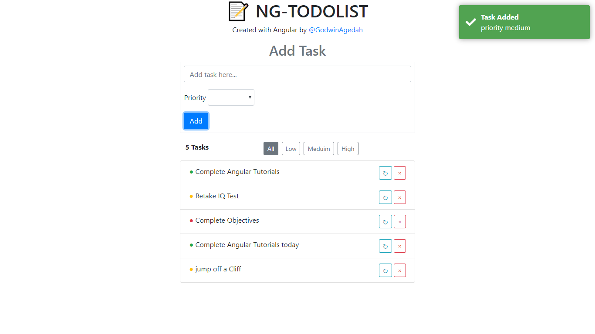

# NgTodolist

This a Todolist written in angular, you can perform CRUD functionailites on task and sort task based on priority. 

## What i learnt

Using Pipes to format data.
sorting Data in the component from the HTML.
Two Way Data binding.
Template Driven form and also validating Input fields.
Using angular directives to control UI Elements.
Create a toastr service to send notification messages.
Running build in production mode and deploying.

## Screenshots

## Side Info

This is my first Angular project.
